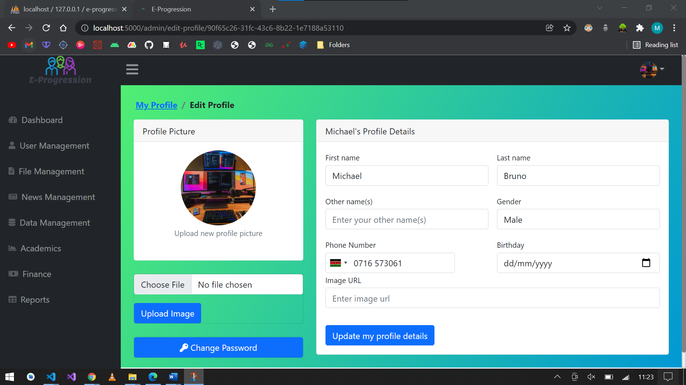

# E-Progression
This is an integration of two systems, the adminstrator Website Portal and the Parent Android Application. Once students' exam results have been marked and processed, the website allows administrators capability to upload their results in a defined format on excel sheets which are then uploaded to the systems database.

The administrator can upload fee payment history of each student once their fees have been payed, post school news either academic related or events related such as games announcements, manage user accounts, create new user accounts and more. The other main functionality of the administrator is to send exam results to parents after uploading them to the system through the excel sheets. 

Parents who own the Parent Android Application will receive notifications of which exam has been released which can be viewed in the results screen, while those who do not own an account will receive SMS messages with detailed summary of their student's results

Admin Dashboard Home Page

Admin Dashboard User Management Page

Parent Android Application Screenshots

  
  
  
  
  
  
  
  
  
  
  
  

