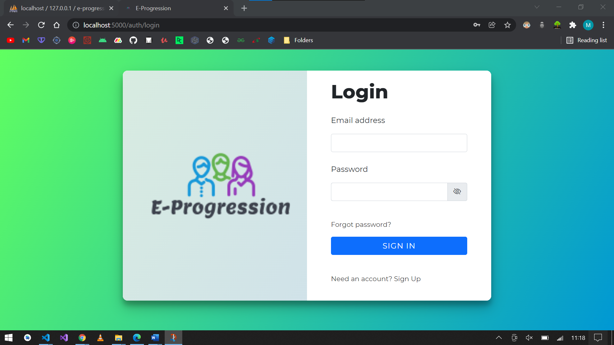
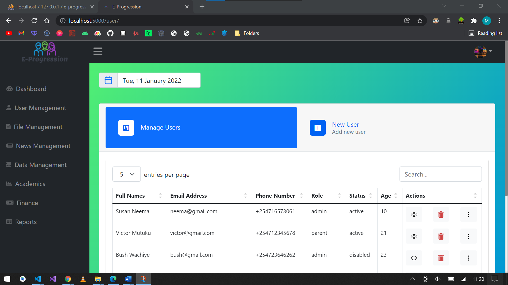
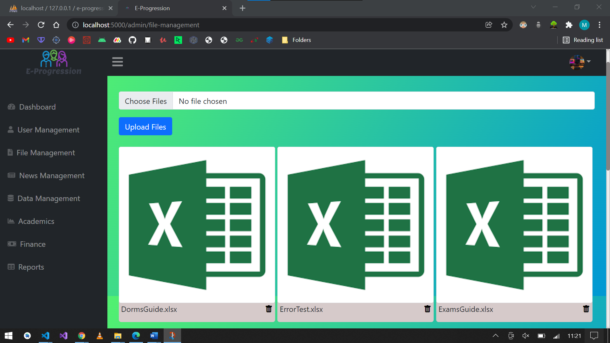
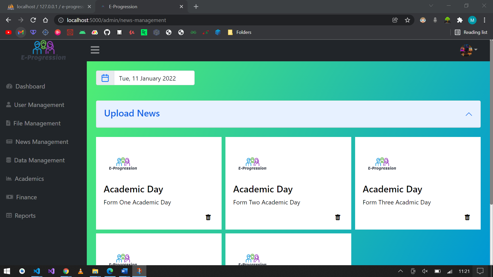
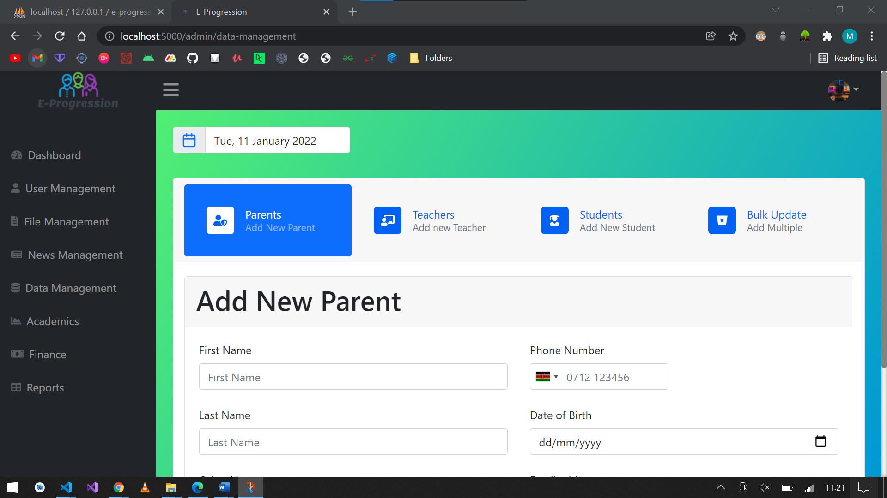
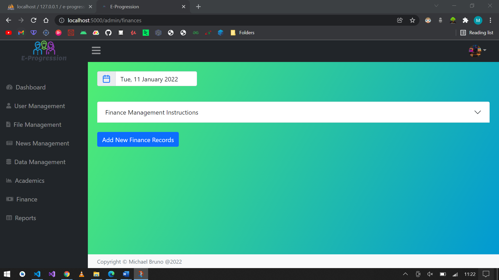
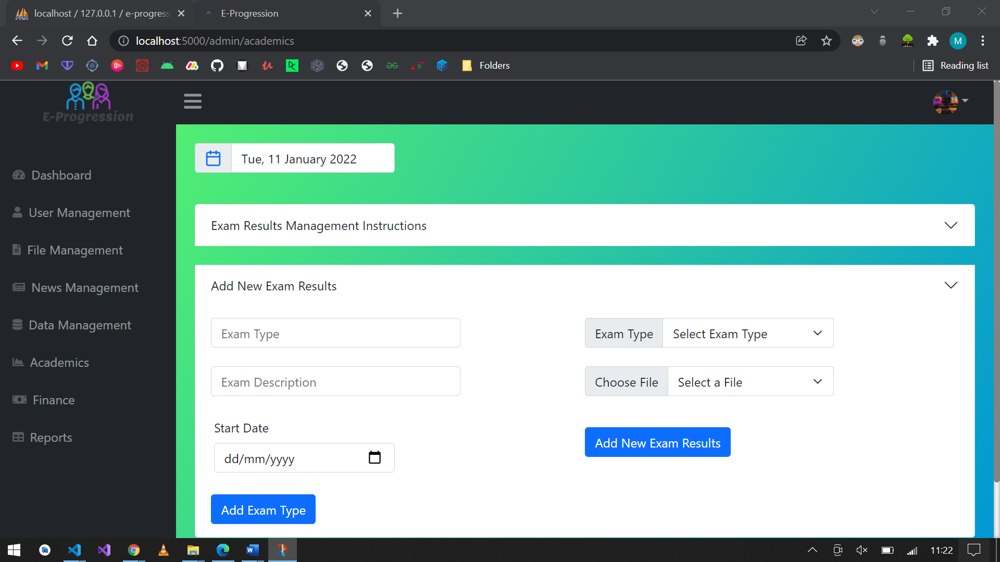
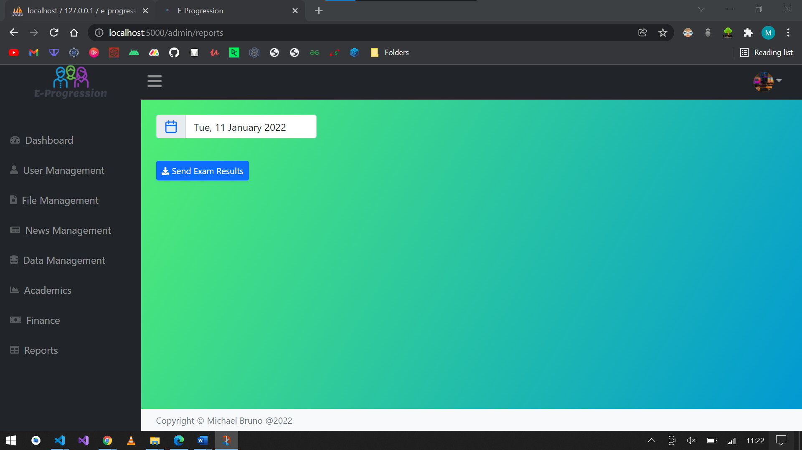
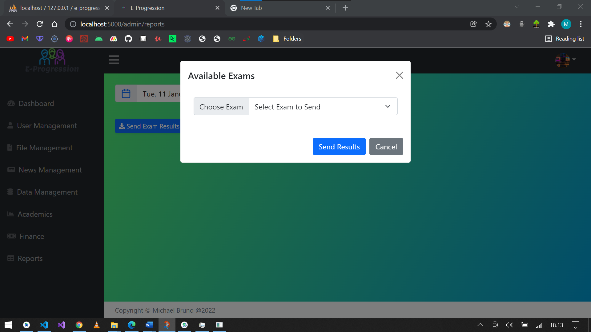

# E-Progression-Web
A system that will allow parents view their children's results once exams are marked and processed, school administrators to post various school events and later implement chat between parents and teachers. This being the api and the administrator dashboard,it will have functionalites as uploading results as excel sheets, and more.

  

